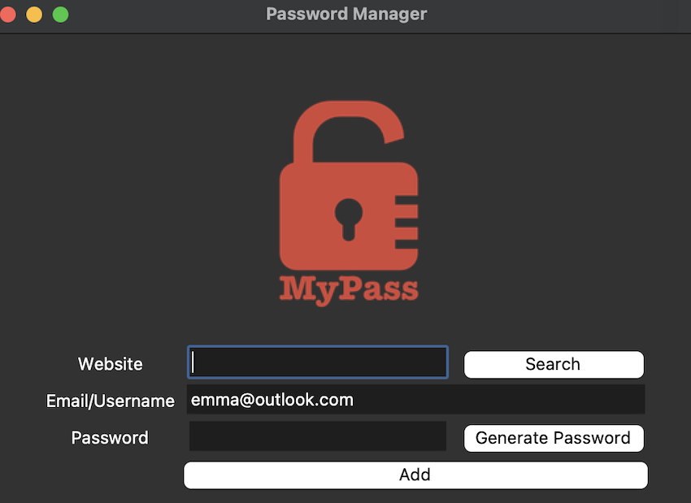

# Password Manager
The password manager is a desktop app allows users generate, save and search passwords for specifc website/Account.

## GUI Building
This interface of this app is built using tkinter module.  

## How to suse
- download all files in this [folder](https://github.com/byJingL/100-Days-of-Python/tree/main/Intermediate/day30_PasswaorManagerAdvanced)
- run [main.py](https://github.com/byJingL/100-Days-of-Python/blob/main/Intermediate/day30_PasswaorManagerAdvanced/main.py)
